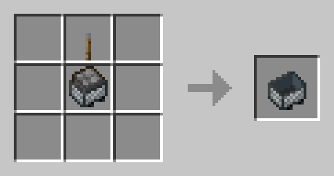

#  Controllable Carts

This mod adds the **Minecart with Controls**, a new type of Minecart which is controllable by the player.

## How to use it
### Crafting
Craft the Minecart with Controls by combining a Furnace Minecart with a lever.  

### Fueling
First, you add fuel to the cart via Coal, Charcoal, or Coal Blocks. Coal and Charcoal add one fuel point, and coal blocks add 9.   
Carts can hold a maximum of 100 fuel points.

When no fuel is remaining, you can no longer accelerate the cart.
### Controls
To control the cart, by default use `W` to accelerate and `S` to decelerate. These keys are based on whatever keys you have set for the `forward` and `backward` actions.  
  
### HUD
When riding the cart, a small HUD will appear above your hotbar.
This includes the speed of the cart in blocks per second (bl/s) and the amount of fuel remaining.

Enjoy!